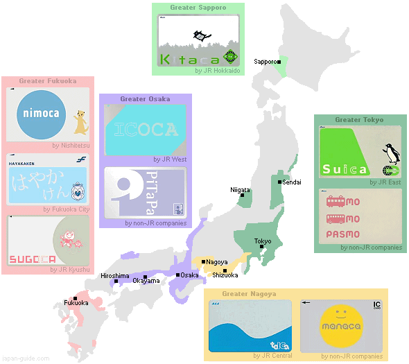

# Guide à l'arrache pour le Japon

Dernière mise à jour : 6 février 2023

> *Le 24 décembre 2015, Didier et Hadrien sont allés au Japon, sans yen ni savoir parler japonais. Ces pages leurs étaient initialement destinées. Faites-en bon usage !*

Auteurs : Jill-Jênn Vie, Antoine Becquet, Michel Blockelet, Tomoko Kozu

## Où ?

### Incontournables, première fois

- Kyoto, au moins 3 jours
- Tokyo, au moins 3 jours
- Nara, 1 jour suffit
- Osaka pour le délire d'une grande ville, 1-2 jours
- Itsukushima (Miyajima), près de Hiroshima, 1 jour suffit

### Autres fois

- Takayama, une sorte de mini-Kyoto dans les montagnes
- Shirakawa-go, toits de chaume (*Higurashi no naku koro ni*)
- Kanazawa, avec Kenroku-en le jardin de toutes saisons l'une des merveilles du Japon
- Beppu (ou Kannawa), la ville qui fume tellement il y a de onsen
- Hokkaido, des sushis encore meilleurs qu'au reste du Japon, mais attention aux ours
- Jigoku-mushi (vapeurs de l'enfer) comme Kannawa ou Noboribetsu à Hokkaido
- Yakushima, la forêt de Princesse Mononoké (attention, difficile d'accès car de nombreux typhons, et randonnée sportive)
- Autour du Fuji pour avoir la vue sur le Fuji (ou alors grimper le Fuji, mais bon, je l'ai fait, je ne recommande pas forcément, y a des gens qui sont morts, moi j'ai eu mal au crâne à cause de l'altitude parce qu'on voulait absolument avoir le dernier bus donc on est redescendus en courant)
- Shimanami kaido, le paradis des cyclistes

## Infos pratiques

### Convinis

7-Eleven, FamilyMart, Lawson… ouverts 24/7, ce seront vos meilleurs amis. Ce sont des magasins de proximité qui proposent un peu de tout comme biens et services (timbres, photocopie). Il y en a un peu partout ; dans les grandes villes, il y en a même à chaque coin de rue.

Ils disposent de repas tout prêts et de bonne qualité (niveau sandwicherie) et même de repas chauds (poulet frit) et boissons chaudes (latte). Lorsque vous achetez un plat qui peut être réchauffé, le caissier vous demandera si vous voulez qu'il le fasse pour vous ; les convinis disposent tous de fours à micro-ondes pour ce faire (et c'est gratuit).

Si vous achetez de l'alcool, le caissier vous demandera d'appuyer sur « OK » sur l'écran de votre côté, pour confirmer que vous avez l'âge requis (20 ans ou plus).

### Wi-Fi

Le Wi-Fi est disponible sur tous les quais des gares JR, Tokyo Metro, Kintetsu, dans la Keihan (Kyoto) et à proximité de tout convini. Sinon vous pouvez prendre un Pocket Wi-Fi.

### Payer

Pour retirer de l'argent, tous les ATM n'accepteront probablement pas votre carte. Mais chaque 7-Eleven a un ATM 7-Bank qui a de fortes chances de fonctionner. Les frais seront moindres que si vous changez de l'argent en France (source : [TransferWise](https://transferwise.com/au/blog/atms-in-japan)).

Pour acheter des titres de transport ou parfois des tickets à l'entrée des restaurants, il faut entrer la monnaie avant d'appuyer sur les boutons. Sinon ils ne sont tout simplement pas activés.

### Acheter tax-free

Dans la plupart des boutiques, vous pouvez acheter Tax-free, à partir de 5000 JPY. Pour ce faire, il vous faut votre passeport ; un reçu y sera attaché, et vous paierez directement le montant sans taxe. En principe, la douane contrôle lors de votre départ que vous avez toujours les biens mentionnés sur ces reçus et vous demande de payer la taxe si vous ne les avez plus ; en pratique, il n'y a jamais personne pour contrôler (surtout que le passage à la douane est après avoir enregistré vos bagages…).

Dans beaucoup de cas, vous devrez d'abord acheter vos biens, puis passer à un comptoir spécial (soit au sein de la boutique, soit quelque part dans le centre commercial) pour qu'ils s'occupent de vous rembourser la taxe sous présentation du reçu et des biens achetés.

Si les biens sont "consommables" (nourriture ou stylos par exemple), ils seront scellés dans un sac, à ne pas ouvrir avant le passage à la douane.

### S'orienter

À Tokyo ? C'est impossible, malheureux ! Les adresses sont données sous la forme de trois chiffres ; le premier correspond au numéro du bloc, le deuxième à l'ordre de construction au cadastre, et le troisième je ne sais plus. Rien n'est consécutif. (À Kyoto c'est plus simple car en damier.)

Demandez votre chemin, les Japonais, les citoyens les plus polis du monde, vous seront d'une grande aide. N'oubliez pas de les remercier.  
Si besoin, n'hésitez pas à demander votre chemin à un policier. Ils connaissent souvent très bien leur quartier et se sentiront obligés de vous aider. (Attention à ne pas abuser de la politesse des Japonais.)

### Transport

Attention.

Et encore, ça ce n'est que le métro. Il y a trop de lignes appartenant à trop compagnies différentes (JR ≠ métro ≠ Toei ≠ Chūō ≠ Yurikamome ≠ …), il est déconseillé de prendre des tickets journée.

Quel que soit le moyen que vous choisissez, n'oubliez pas de *tap in* et de *tap out*. Si vous allez trop profond dans le Japon, il n'y aura plus de caractères latins. Il faudra demander gentiment : 「すみません、これは三鷹ですか？」 (*sumimasen, kore wa Mitaka desu ka? arigatou*) : « Excusez-moi, il est bien écrit Mitaka ici ? Merci ».

Bonne nouvelle, Google Maps fonctionne sur le réseau japonais. Ça vous sauvera la vie. Ça vous indique même le tarif. Attention, les limited express sont le plus souvent plus chers car il faut aussi réserver une place à bord. Dans la mesure du possible il vaut mieux rester sur le même réseau plutôt que mixer Tokyo Metro, JR, Toei Line, etc.

#### IC Card

Le plus simple c'est d'imprimer une **IC card** (ex. [Pasmo](http://www.pasmo.co.jp/en/)), carte rechargeable qui fonctionne avec presque tous les métros et bus, ou de payer à chaque voyage. Il en existe de toutes sortes. Vous pouvez vous la faire rembourser en la recyclant.

Pour utiliser la IC card, faites la simplement biper à l'entrée et à la sortie du métro. Un écran vous indiquera le montant restant disponible sur votre carte. Vous pouvez la recharger à volonté, ou payer la différence à la gare d'arrivée si le solde est insuffisant. Vous pouvez même l'utiliser en convini où dans certains restaurants. Vous pouvez ensuite consulter votre itinéraire soit en borne soit avec une appli NFC (j'adore [Suikakeibo](https://suikakeibo.jp/en)), ou parfois même utiliser votre smartphone comme IC card.

#### Tickets unité

Si vous payez au voyage, lorsque que vous voulez aller de X à Y, regardez combien il faut pour aller à Y et demandez poliment à la machine un ticket de ce montant (c'est un peu comme un système de timbres). En général, au-dessus de la machine, il y aura une carte du réseau avec les prix pour chaque station indiqués. Lorsque vous insérerez votre ticket pour sortir à Y, il ne ressortira pas, c'est normal et écologique.

### Japan Rail Pass

Le Japan Rail Pass permet de voyager sur toutes les lignes JR (qui sont un peu partout) gratuitement. C'est rapidement rentable si vous voyagez à travers le Japon, et ça peut permettre d'économiser sur certains trajets locaux aussi. Il y a des déclinaisons locales si vous ne voyagez que dans une partie du Japon (ex. JR West Rail Pass juste pour le Kansai).

Attention : il faut l'acheter avant son départ, sur un site Internet correspondant à l'endroit où vous habitez ; vous obtiendrez un coupon à échanger dans un des bureaux JR, présents en général aux aéroports et aux gares. À noter que souvent les bureaux des aéroports sont pris d'assaut, du coup si vous n'en avez pas besoin tout de suite, vous pouvez passer plus tard dans une gare, c'est souvent beaucoup plus rapide (5 minutes d'attente au lieu d'une heure). Le JR Pass n'est disponible que pour les touristes, pas les résidents.

Pour utiliser le JR Pass, il suffit de passer sur le côté des portes de contrôle, il y a toujours un passage gardé par un agent. Vous montrez votre JR Pass, et il vous laissera passer, tout simplement.

Les lignes JR incluent les Shinkansen, les trains hyper grande vitesse, sauf les modèles Nozomi et Mizuho (les plus rapides, mais leurs lignes ont toujours d'autres trains légèrement moins rapides qui font les mêmes routes). Si vous comptez prendre un Shinkansen, deux possibilités : soit réserver des sièges à l'avance, ce qui est gratuit et peut se faire dans n'importe quelle gare Shinkansen ; soit aller dans un wagon *unreserved*, ce qui permet de gagner un peu de temps mais ne garantit pas de place assise (parfois ces wagons sont pleins à craquer, parfois presque vides). À noter qu'il n'y pas de contrôle de vos réservations de sièges ; vous pouvez du coup rater le train, ce n'est pas grave, c'est juste pas sympa d'avoir réservé un siège et de ne pas l'avoir utilisé, mais c'est tout.

Il y a aussi beaucoup de lignes JR locales ; par exemple, Tokyo a de nombreuses lignes JR qui sont plus pratiques que le métro ou autres lignes privées, et il est possible d'aller à la plupart des lieux touristiques des alentours avec des lignes JR. Mais le fait que seul le JR soit inclus dans votre passe demande un effort logistique important.

Par contre, il faut faire attention car certains trains JR peuvent continuer vers une ligne privée ; vous le verrez souvent à un changement de couleur sur le schéma de la ligne. Dans ce cas, il faudra payer la portion du trajet sur la ligne privée. Il y a à peu près toujours des bornes *Fare adjustment* avant les portiques de sortie pour vous acquitter de la somme.

## Manger

### Indications de prix

- 1000-2000 yens : raisonnable
- 3000+ : attention parfois un attrape-touristes
- 11000 : kaiseki

### Spécialités

* Ramen
* Osaka : okonomiyaki, takoyaki, kushikatsu, yakisoba
* Convini : onigiri, karaage (poulet frit)
* Sushi : dans les villes portuaires (Niigata, Kanazawa, Tokyo, Choshi)
* Soba (chaud ou froid)
* Udon (chaud ou froid)
* Nabe
* Tempura
* Curry japonais

### Chaînes

Au Japon, beaucoup de restaurants sont des chaînes, mais souvent de bonne qualité ! Je recommande :

1. Fluffy pancakes : soit Hoshino Coffee, soit A Happy Pancake (20 minutes de préparation)
1. Kushi hacchin pour les brochettes à Tokyo ; sinon Torikizoku dans le reste du Japon
1. Low-cost don (don signifie "sur riz") : gyudon à Yoshinoya > Sukiya > Katsuya > Matsuya > Nakau
1. CoCo Ichibanya curry japonais
1. Tempura Tendon Tenya
1. Chiyoda sushi ou Sushiro pour les sushi
1. Shabu-yo ou Nabezo pour la viande
1. Jojo-en (wagyu à bas prix 3500 yens, certains sont ouverts le dimanche)
1. Ice Monster (mangues givrées ; bon, certes, c'est taïwanais)

## Villes

### Kyoto

Kyoto estime que c'est LA culture japonaise traditionnelle, que l'empereur est temporairement parti à Tokyo (il y a 150 ans) mais que c'est temporaire et qu'il va revenir. En cela, ils estiment qu'ils sont un peu la véritable capitale, bref ça ressemble un peu à Lyon quoi. Ils ont des standards de politesse encore un peu plus hauts : [*How Not to Be a Tourist in Kyoto*](http://www.citylab.com/navigator/2015/08/how-not-to-be-a-tourist-in-kyoto/401714/)

#### Kyoto à l'est

Je conseille la ligne Keihan à l'est, plus pratique que le bus pour se déplacer, qui a du Wi-Fi gratuit, et qui passe par tout plein d'endroits incroyables.

- le célèbre Fushimi Inari-taisha : un torī, puis un autre, puis un autre… Il y en a 10000.
- Heian jingu et son merveilleux jardin.
- le magnifique quartier de Gion, voir par ex [cette balade](https://goo.gl/maps/aK6G4ZjZ8qYmxdzFA).
- Kiyomizu-dera
- Ginkaku-ji est le pavillon d'argent (superbe jardin)

À propos de Gion : depuis novembre 2019 il est interdit de prendre des photos dans la plupart de Gion car des geisha se sont fait harceler par des touristes débiles. Merci de respecter le travail des geisha. Il y a 200 geiko et 70 meiko (apprenties) donc elles sont rares et doivent être préservées.

#### Kyoto à l'ouest

- Kinkaku-ji le pavillon d'or (superbe pavillon)
- Ryoan-ji : jardin de cailloux
- Arashiyama : bambouseraie
- Nijō-jō : ancienne villa impériale

#### Centre-ville

- En fait rien que Kyoto Station est assez incroyable
	- Au 10e étage y a un étage entier de 12 différents ramen reprenant les styles de tout le Japon ; la spécialité de Kyoto étant le *tsukemen*, i.e. nouilles séparées du bouillon
	- Plein de super restau autour, parfois au sous-sol, c'est super facile de se perdre dans ce conglomérat gigantesque de centres commerciaux
- Ponto-chō : le quartier avec le plus fort coût sur largeur du monde ; idéal pour un dîner romantique sur pilotis (attention, 11000 yen).
- Musée international du manga
- [Teramachi Street](https://www.google.com/maps/@35.0088827,135.7671739,3a,75y,80.58h,70.82t/data=!3m6!1e1!3m4!1sK7rsLckPyZPQpwz6zFxTzg!2e0!7i13312!8i6656?hl=fr) : bentō à midi pour 500 ¥ (< 4 €), ou vendeurs ambulants d'onigiri
- Yoshinoya : gyūdon pas chers (bœuf à l'oignon sur riz)

### Tokyo

Je recommande absolument Shinjuku Gyoen. Il y a plein d'autres jardins impériaux.

#### Shibuya crossing

Dès que la nuit tombe (potentiellement à 16 h 30, [je ne déconne pas](https://www.timeanddate.com/sun/japan/tokyo?month=11&year=2023)), après avoir fait coucou à [Hachikō](https://fr.wikipedia.org/wiki/Hachikō), l'illustre chien, allez au Starbucks au premier étage du Tsutaya (impossible de le louper) pour admirer le croisement piéton.

#### [Asakusa](https://www.kanpai.fr/asakusa)

Le temple [Sensō-ji](https://www.kanpai.fr/tokyo/senso-ji), dans le vieux quartier d'Asakusa, est vraiment cool bien que très touristique.

Entre la station Asakusa et le temple, il y a la superbe [Nakamise Street](https://goo.gl/maps/57Adn88kQCk) : sur 250 m, vous trouverez toutes sortes de goodies (baguettes, estampes, [taiyaki](https://en.wikipedia.org/wiki/Taiyaki) artisanaux : les gâteaux en forme de poisson, fourrés à la pâte de haricot rouge *azuki*).

- [Temple des chats :3](http://www.kanpai.fr/tokyo/imado-jinja)
- [SkyTree](http://www.kanpai.fr/tokyo/tokyo-skytree), 634 m et son immense centre commercial (y a aussi du Ghibli, cherchez Donguri Kyowakoku).

#### Akihabara

Difficile de trouver quelque chose. Les blockbusters sont mis en avant, et plein de choses qu'on ne connaît pas encore en France sont mitraillées, ce qui est un peu frustrant :)  
Mais en y passant du temps (on peut faire 3 jours dans le quartier sans faire deux fois le même magasin) il est possible de faire des trouvailles, aussi bien en culture otaku qu'en matériel électronique (des affaires, des clés USB ou SSD à prix cassés !).

Aussi, attention : dans certains magasins, plus vous montez dans les étages, moins c'est autorisé pour les enfants.  
Dans d'autres par contre, ce sont là que se trouvent les bonnes affaires (certains RDC sont des arnaques à touristes et proposent des prix exorbitants).

- J'adore [Super Potato](https://goo.gl/maps/rRqn9xGB3ysQsGy16), 1er étage, qui contient plein de retrogaming y compris des bornes d'arcade.
- Pour les goodies anime, [COSPA](https://goo.gl/maps/HNeC46DfCFJ4j4Tv6) ou [Animate](https://goo.gl/maps/D1MNpXX3PAeyWasu9).
- Pour tout le reste, [Don Quijote](https://goo.gl/maps/V8aD6JDZqMGbUgtV8).

Près de là, il y a Kanda qui a plein de bons restaurants. Tandis que Akihabara n'en a pas vraiment.

#### Harajuku

Le temple de la mode. Descendez jusqu'à Omotesando ou perdez-vous dans la Meiji-dori.

- Takeshita-dori
- Brahms Path & Mozart St (je viens de les trouver par sérendipité)
- Une autre petite rue avec des magasins de vintage toys très random que je n'arrive pas à retrouver parce que c'est impossible de retrouver quoi que ce soit dans Harajuku. OK trouvée : c'était tout simplement Cat Street (beaucoup de restau) et ses nombreuses rues étroites perpendiculaires ou parallèles.

Super bistrot : [Sakuratei](https://goo.gl/maps/YWuya9x5kXqvXuKu8). Excellents okonomiyakis.

#### Shinjuku

- Shinjuku Gyoen, le jardin traditionnel japonais et les buildings autour.
- Golden Gai
- Lol Kabukicho

Pas très loin de là (à une station de JR donc 4 min), il y a [Nakano Broadway](http://www.kanpai.fr/tokyo/nakano-broadway), plein de magasins de retro.

#### Roppongi

- Luida's bar (Bar à thème Dragon Quest)
- Souvent des super expositions dans le musée de la Mori Tower, le [Mori Art Museum](https://www.mori.art.museum/en/)

#### [Odaiba](http://planetemaneki.com/10-choses-incontournables-a-faire-odaiba)

GUNDAM MOTHAFUCKAS

### Osaka

- Le château de Himeji est une merveille si vous êtes prêts à faire le trajet. Sinon, le château d'Osaka est une bonne alternative, plus facilement accessible.
- Dotonbori !!! Et Shinsaibashi, mangez des kushikatsu (brochettes frites)
- Shinsekai
- Den Den Town (un truc d'otaku, encore), c'est parti pour les HDD et SSD à prix cassés

### Nara

- [Nara Park](http://nara-park.com/en/) avec ses 1000 biches qui s'inclinent poliment quand vous leur donnez à manger et qui savent traverser aux passages cloutés (eau chauffée) :o
- Sanctuaire [Kasuga-taisha](http://www.kasugataisha.or.jp/about/index_fr.html)
- Temples [Todai-ji](http://www.todaiji.or.jp/english/index.html),  [Toshodai-ji](http://www.toshodaiji.jp/english/index.html), [Yakushi-ji](http://www.nara-yakushiji.com/) ou [Horyu-ji](https://japonhautecouture.com/articles/autres/le-temple-horyu-ji-la-plus-ancienne-construction-en-bois-du-monde/), la plus ancienne construction en bois du monde (l'an 711).

## Activités diverses

* Manger, au cas où c'était pas clair
* Karaoke : l'activité numéro 1 au Japon, Uta Hiroba a les meilleurs plans (parfois crème glacée incluse), regardez les tarifs sur les sites web de chaque kara ; pratique quand on a raté le dernier métro (matez "free time")
* Hanami en avril, momiji (chasser les feuilles rouges) en novembre
* Salles d'arcade, bowling Round One, Dance Dance Revolution
* Faire un onsen/ryokan est une expérience extraordinaire, mais demande de s'y prendre à l'avance. Ceux-ci se situent dans les montagnes souvent à quelques heures des grandes villes (ex. Kurama Onsen au nord de Kyoto). Sinon il y a les sento (eau chauffée) dans les grandes villes.
* Atelier confection wagashi
* [Pèlerinage anime](https://vie.jill-jenn.net/2019/08/15/pelerinage-haruhi-suzumiya/)
* Musée Ghibli à Mitaka dans la banlieue de Tokyo, Parc Ghibli dans la banlieue de Nagoya
* Mater un match de baseball

### Quand on est un peu plus résident

* Bon odori : danser en août pour apaiser l'esprit des défunts
* Matsuri réguliers (par exemple j'adore le [Nihonbashi-Kyobashi matsuri](https://lespetitspapiersdemelo.wordpress.com/2020/04/30/le-nihonbashi-kyobashi-matsuri-fait-danser-tokyo/))
* Feux d'artifice
* Anime Nightclub à Akihabara
* Halloween à Shibuya

Bon courage.
