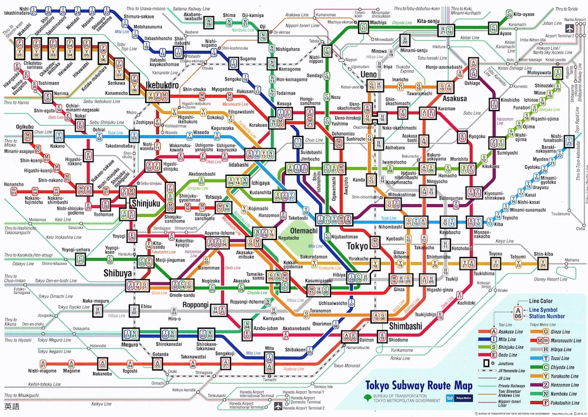

# Guide à l'arrache pour le Japon

> *Le 24 décembre 2015, Didier et Hadrien sont allés au Japon, sans yen ni savoir parler japonais. Ces pages leurs étaient initialement destinées. Faites-en bon usage !*

Auteurs : Jill-Jênn Vie, Antoine Becquet, Michel Blockelet, Tomoko Kozu

## Infos pratiques

### Convinis

7-Eleven, FamilyMart, Lawson… ouverts 24/7, ce seront vos meilleurs amis. Ce sont des magasins de proximité qui proposent un peu de tout comme biens et service, à des prix d'un supermarché. Il y en a un peu partout; dans les grandes villes, il y en a même à chaque coin de rue.

Ils disposent de repas tout prêts et de bonne qualité (niveau sandwicherie et non supermarché), et même de repas chauds. Lorsque vous achetez un plat qui peut être réchauffé, le caissier vous demandera si vous voulez qu'il le fasse pour vous; les convinis disposent tous de fours à micro-ondes pour ce faire (et c'est gratuit).

Si vous achetez de l'alcool, le caissier vous demandera d'appuyer sur "OK" sur l'écran de votre côté, pour confirmer que vous avez l'âge requis.

### Wi-Fi

Le Wi-Fi est disponible sur tous les quais des gares JR, Tokyo Metro, et à proximité de tout convini.

### Payer

Pour retirer de l'argent, tous les ATM n'accepteront probablement pas votre carte. Mais chaque 7-Eleven a un ATM 7-Bank qui a de fortes chances de fonctionner. Les frais seront moindres que si vous changez de l'argent en France (source : [TransferWise](https://transferwise.com/au/blog/atms-in-japan)).

Pour acheter des titres de transport ou parfois des tickets à l'entrée des restaurants, il faut entrer la monnaie avant d'appuyer sur les boutons. Sinon ils ne sont tout simplement pas activés.

### Acheter tax-free

Dans la plupart des boutiques, vous pouvez acheter Tax-free, à partir de 5000 JPY. Pour ce faire, il vous faut votre passeport ; un reçu y sera attaché, et vous paierez directement le montant sans taxe. En principe, la douane contrôle lors de votre départ que vous avez toujours les biens mentionnés sur ces reçus et vous demande de payer la taxe si vous ne les avez plus ; en pratique, il n'y a jamais personne pour contrôler (surtout que le passage à la douane est après avoir enregistré vos bagages…).

Dans beaucoup de cas, vous devrez d'abord acheter vos biens, puis passer à un comptoir spécial (soit au sein de la boutique, soit quelque part dans le centre commercial) pour qu'ils s'occupent de vous rembourser la taxe sous présentation du reçu et des biens achetés.

Si les biens sont "consommables" (nourriture ou stylos par exemple), ils seront scellés dans un sac, à ne pas ouvrir avant le passage à la douane.

### S'orienter

C'est impossible, malheureux ! Les adresses sont données sous la forme de trois chiffres ; le premier correspond au numéro du bloc, le deuxième à l'ordre de construction au cadastre, et le troisième je ne sais plus. Rien n'est consécutif.

Demandez votre chemin, les Japonais, les citoyens les plus polis du monde, vous seront d'une grande aide. N'oubliez pas de les remercier.  
Si besoin, n'hésitez pas à demander votre chemin à un policier. Ils connaissent souvent très bien leur quartier et seront ravis de vous aider.

### Transport

Attention.

Et encore, ça ce n'est que le métro. Il y a trop de lignes appartenant à trop compagnies différentes (JR ≠ métro ≠ Toei ≠ Chūō ≠ Yurikamome ≠ …), il est déconseillé de prendre des tickets journée.  
Les moyens de paiement les plus simples sont la [Pasmo](http://www.pasmo.co.jp/en/), carte rechargeable qui fonctionne avec presque tous les métros et bus, ou de payer à chaque voyage.

Si vous payez au voyage, lorsque que vous voulez aller de X à Y, regardez combien il faut pour aller à Y et demandez poliment à la machine un ticket de ce montant (c'est un peu comme un système de timbres). En général, au-dessus de la machine, il y aura une carte du réseau avec les prix pour chaque station indiqués. N'oubliez pas d'*opt-in* et d'*opt-out*. Lorsque vous insérerez votre ticket pour sortir à Y, il ne ressortira pas, c'est normal et écologique.

Si vous utilisez la carte Pasmo, faites la simplement biper à l'entrée et à la sortie du métro. Un écran vous indiquera le montant restant disponible sur votre carte. Vous pouvez la recharger à volonté, ou payer la différence à la gare d'arrivée si le solde est insuffisant.

Si vous allez trop loin, il n'y aura plus de caractères latins. Il faudra demander gentiment : « *sumimasen, kore wa Shibuya desu ka? arigatou* » (« Excusez-moi, il est bien écrit Shibuya ici ? Merci »)

Bonne nouvelle, Google Maps fonctionne sur le réseau japonais. Ça vous sauvera la vie.

### Japan Rail Pass

Le Japan Rail Pass permet de voyager sur toutes les lignes JR (qui sont un peu partout) gratuitement. C'est rapidement rentable si vous voyagez à travers le Japon, et ça peut permettre d'économiser sur certains trajets locaux aussi. Il y a des déclinaisons locales si vous ne voyagez que dans une partie du Japon.

Attention : il faut l'acheter avant son départ, sur un site Internet correspondant à l'endroit où vous habitez; vous obtiendrez un coupon à échanger dans un des bureaux JR, présents en général aux aéroports et aux gares. À noter que souvent les bureaux des aéroports sont pris d'assaut, du coup si vous n'en avez pas besoin tout de suite, vous pouvez passer plus tard dans une gare, c'est souvent beaucoup plus rapide (5 minutes d'attente au lieu d'une heure). Le JR Pass n'est disponible que pour les visiteurs temporaires.

Pour utiliser le JR Pass, il suffit de passer sur le côté des portes de contrôle, il y a toujours un passage gardé par un agent. Vous montrez votre JR Pass, et il vous laissera passer, tout simplement.

Les lignes JR incluent les Shinkansen, les trains hyper grande vitesse, sauf les modèles Nozomi et Mizuho (les plus rapides, mais leurs lignes ont toujours d'autres trains légèrement moins rapides qui font les mêmes routes). Si vous comptez prendre un Shinkansen, deux possibilités : soit réserver des sièges à l'avance, ce qui est gratuit et peut se faire dans n'importe quelle gare Shinkansen; soit aller dans un wagon "unreserved seats", ce qui permet de gagner un peu de temps mais ne garantit pas de place assise (parfois ces wagons sont pleins à craquer, parfois presque vides). À noter qu'il n'y pas de contrôle de vos réservations de sièges; vous pouvez du coup rater le train, ce n'est pas grave, c'est juste pas sympa d'avoir réservé un siège et de ne pas l'avoir utilisé, mais c'est tout.

Il y a aussi beaucoup de lignes JR locales; par exemple, Tokyo a de nombreuses lignes JR qui sont plus pratiques que le métro ou autres lignes privées, et il est possible d'aller à la plupart des lieux touristiques des alentours avec des lignes JR.

Par contre, il faut faire attention car certains trains JR peuvent continuer vers une ligne privée; vous le verrez souvent à un changement de couleur sur le schéma de la ligne. Dans ce cas, il faudra payer la portion du trajet sur la ligne privée. Il y a à peu près toujours des bornes "Fare adjustement" avant les portiques de sortie pour vous acquitter de la somme.

## Tokyo

### Shibuya crossing

Dès que la nuit tombe (à 16 h 30, [je ne déconne pas](http://www.sunrise-and-sunset.com/fr/sun/japon/tokyo)), après avoir fait coucou à [Hachikō](https://fr.wikipedia.org/wiki/Hachikō), l'illustre chien, allez au Starbucks au premier étage du Tsutaya (impossible de le louper) pour admirer le croisement piéton.

### Sensō-ji

Ce superbe temple, dans le vieux quartier d'Asakusa, a été récemment rénové.

Entre la station Asakusa et le temple, il y a la superbe [Nakamise Street](https://goo.gl/maps/57Adn88kQCk) : sur 250 m, vous trouverez toutes sortes de goodies (baguettes, estampes, [taiyaki](https://en.wikipedia.org/wiki/Taiyaki) artisanaux : les gâteaux en forme de poisson, fourrés à la pâte de haricot rouge *azuki*).

### Harajuku

Le temple de la mode. Descendez jusqu'à Omotesando ou perdez-vous dans la Meiji Dori.

Super bistrot : [Sakuratei](https://encrypted.google.com/maps/place/%E3%81%95%E3%81%8F%E3%82%89%E4%BA%AD/@35.6706125,139.7083666,15z/data=!4m2!3m1!1s0x0:0x9728d6e949274f99?hl=fr&sa=X&ved=0ahUKEwiomszSufTJAhXCaRQKHdgvCpwQ_BIIvgYwZA). Excellents okonomiyakis.

### Akihabara

Difficile de trouver quelque chose. Les blockbusters sont mis en avant, et plein de choses qu'on ne connaît pas encore en France sont mitraillées, ce qui est un peu frustrant :)  
Mais en y passant du temps (on peut faire 3 jours dans le quartier sans faire deux fois le même magasin) il est possible de faire des trouvailles, aussi bien en culture otaku qu'en matériel électronique.

Aussi, attention : dans certains magasins, plus vous montez dans les étages, moins c'est autorisé pour les enfants.  
Dans d'autres par contre, ce sont là que se trouvent les bonnes affaires (certains RDC sont des arnaques à touristes et proposent des prix exorbitants).

### Shinjuku

[Nakano](http://www.kanpai.fr/tokyo/nakano-broadway) à proximité

### Roppongi

Luida's bar (Bar à thème dragon quest)

### [Odaiba](http://planetemaneki.com/10-choses-incontournables-a-faire-odaiba)
GUNDAM MOTHAFUCKAS

### [Asakusa](http://www.kanpai.fr/asakusa)
- [Temple des chats :3](http://www.kanpai.fr/tokyo/imado-jinja)
- [Kaminarimon / Senso-ji](http://www.kanpai.fr/tokyo/senso-ji)
- [SkyTree](http://www.kanpai.fr/tokyo/tokyo-skytree)

### Autre
- Tsukiji (marché aux poissons). Y aller tôt. Y manger des sushi à midi.

## Kyoto

- [How Not to Be a Tourist in Kyoto](http://www.citylab.com/navigator/2015/08/how-not-to-be-a-tourist-in-kyoto/401714/)
- Fushimi Inari-taisha : un torī, puis un autre, puis un autre…
- Ginkaku-ji est le pavillon d'argent (superbe jardin), Kinkaku-ji le pavillon d'or (superbe pavillon)
- Ryoan-ji : jardin de cailloux
- Nijō-jō : château
- Ponto-chō : le quartier avec le plus fort coût sur largeur du monde ; idéal pour un dîner romantique sur pilotis.
- Musée international du manga

### Se nourrir

- [Teramachi Street](https://www.google.com/maps/@35.0088827,135.7671739,3a,75y,80.58h,70.82t/data=!3m6!1e1!3m4!1sK7rsLckPyZPQpwz6zFxTzg!2e0!7i13312!8i6656?hl=fr) : bentō à midi pour 500 ¥ (< 4 €), ou vendeurs ambulants d'onigiri
- Tsukemen : les ramen de Kyoto (spécialité)
- Yoshinoya : gyūdon pas chers (bœuf à l'oignon sur riz)

## Osaka

- Himeji Castle vaut le détour si vous êtes prêts à faire le trajet. Sinon, l'Osaka Castle est une bonne alternative, plus facilement accessible.
- Shinsekai
- Dotonbori
- Den Den Town (un truc d'otaku, encore)

## Nara

- [Nara Park](http://nara-park.com/en/)
- [Kasuga-taisha](http://www.kasugataisha.or.jp/about/index_fr.html)
- [Todai-ji](http://www.todaiji.or.jp/english/index.html)
- [Toshodai-ji](http://www.toshodaiji.jp/english/index.html)
- [Yakushi-ji](http://www.nara-yakushiji.com/)

## Bouffe

* Okonomiyaki (Osaka)
* Takoyaki (Osaka)
* Ramen
* Onigiri
* Sushi (Tsukiji)
* Soba
* Yakisoba
* Udon
* Chirashi
* Nabe
* Tempura
* Curry japonais

### Chaînes

Au Japon, beaucoup de restaurants sont des chaînes, mais souvent de bonne qualité ! Je recommande :

1. Jojoen (wagyu à bas prix, certains sont ouverts le dimanche)
2. Hoshino Coffee (leurs pancakes de 20 minutes)
3. Ice Monster (bon certes, c'est taïwanais)

## Divers

* Karaoke
* Musée Ghibli
* Salle d'arcade
* Faire un onsen/ryokan est une expérience intéressante, mais demande de s'y prendre à l'avance. Ceux-ci se situent dans les montagnes souvent à quelques heures des grandes villes.

Bon courage.
